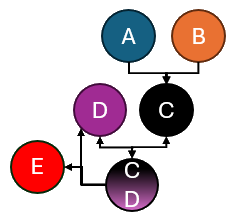
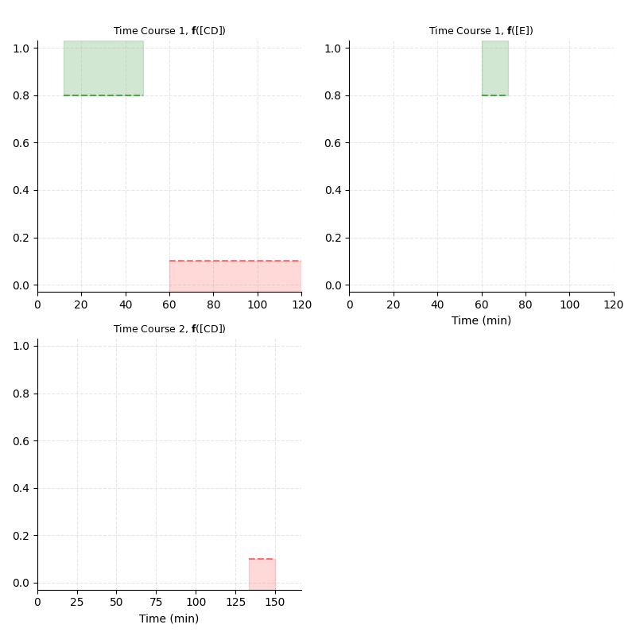

<p align="center">
  
</p>

# EmergeX

EmergeX is a Python library for building chemical reaction networks (CRNs), simulating their dynamics, and optimizing model parameters against either desired emergent behaviors or experimental time-course data. It supports workflows where you define a reaction system, specify what the system should do, and then use gradient-based optimization to search for parameters that produce that outcome. The library supports a built-in parameter fitting pipeline. Examples of experiment fitting API implementation are coming soon (> Version 1.0.0).

## Example outputs

As an example, we provide the output visualizations of the workflow shown in examples/optimizeBehaviors/smallCRN.py under assets, and are shown below. First, establish the reaction network you wish to implement. For reference, we will use the following reaction network landscape in this demonstration:



## What EmergeX does

EmergeX is organized around six main pieces:

1. `emergex.crn`
   Build CRNs from `Reaction`, `Component`, and `ReactionNetwork`.
2. `emergex.core`
   Define time spans, interruptions, simulation settings, and CRN metadata.
3. `emergex.behaviors`
   Describe desired `HIGH` and `LOW` behaviors over selected time windows.
4. `emergex.experiments`
   Fit model outputs to experimental signals.
5. `emergex.optimization`
   Select free and linked parameters, then run optimization.
6. `emergex.visualization`
   Generate plots and MP4 animations from optimization results.

This supports designing a CRN that exhibits a target behavior, and fitting a CRN model to experimental data.

## Basic workflow

The standard workflow is:

1. Build a reaction network.
2. Define the simulation time course, including any staged additions or perturbations.
3. Specify either target behaviors or experimental signals.
4. Select the parameters that are allowed to vary.
5. Run optimization.
6. Save the result and generate visualizations.

## Building a reaction network

At the lowest level, EmergeX works with reactions, components, and a reaction network container.

```python
from emergex import Reaction, Component, ReactionNetwork

combineAB = Reaction(5e-5, "A + B -> C")
cdComplex = Reaction(1e-2, "C + D <-> CD", backwardRate = 1e0)
makeE = Reaction(3e-2, "CD -> D + E")

compA = Component("A", 100)
compB = Component("B", 80)
compD = Component("D", 5)

network = ReactionNetwork()
network.addRxns([combineAB, cdComplex, makeE])
network.addComponents([compA, compB, compD])
```

Important notes:

- EmergeX does not impose units, so concentration and rate units must be internally consistent.
- Stoichiometry is represented by repeating species names rather than by coefficients.

## Direct simulation

For straightforward simulation without optimization:

```python
network.simulateReactionFn(600, simDataResolution=201)
result = network.SimResults[-1]
```

This is the simplest way to inspect trajectories and verify that the network behaves sensibly before adding optimization targets.

## Time spans and interruptions

EmergeX is designed for multi-step experiments where materials may be added or conditions changed during the run. A time course can be created with discontinuous changes to reaction conditions based on a pre-defined schedule.

```python
from emergex import TimeSpan, Interruption

interrupt = Interruption(network.Components["B"], 40, interruptionType="ADD")
time_course = [
    TimeSpan(3600),
    TimeSpan(3600, [interrupt]),
]
```

This allows you to model pulse additions, delayed stimuli, or other multi-stage protocols.

## Optimizing for behaviors

Behavior optimization is the main design workflow shown in the provided examples.

### Define target behaviors

Behaviors are expressed as time windows in which a normalized signal should be high or low.

```python
from emergex import Behavior, BehaviorGroup, BehaviorTimeCourse

def normalize_by_D(x, concs):
    return x / concs["D"]

behaviorTimeCourseObj = BehaviorTimeCourse(
    time_course,
    [
        BehaviorGroup(
            "CD",
            [
                Behavior("HIGH", 0.1 * 7200, 0.4 * 7200),
                Behavior("LOW", 0.5 * 7200, 1.0 * 7200),
            ],
            normalizeFn = normalize_by_D,
        )
    ],
)
```

This behavior time course describes the landscape shown in the top-left quadrant:


The main abstractions are:

- `Behavior`: One target state over the defined interval.
- `BehaviorGroup`: The species being evaluated and the normalization rule used to score it.
- `BehaviorTimeCourse`: The experiment schedule paired with the behavior groups to evaluate.

### Expose free and linked parameters

The optimization run will only make use of the parameters you explicitly provide. Using the prior defined reaction and component variables, we can instatiate a list of free parameters as shown below.

```python
from emergex import FreeParameter, LinkedParameter

freeParams = [
    FreeParameter(combineAB),
    FreeParameter(cdComplex),
    FreeParameter(makeE),
    FreeParameter(compB),
]
```

Use `LinkedParameter` when a value should be derived from another concentration or rate rather than optimized independently.

### Run the optimization

```python
from emergex import (
    CRNInfoHandler,
    OptimizeBehaviorsManager,
    CRNSimulationRunner,
    CRNOptimizationFramework,
    CompiledOptimizationData,
)

manager = OptimizeBehaviorsManager(
    CRNInfoHandler(network),
    [behaviorTimeCourseObj],
)

simuRunner = CRNSimulationRunner()
optimizer = CRNOptimizationFramework(freeParams)

result = CompiledOptimizationData(
    manager,
    simRunner,
    optimizer,
    iterationCount = 100,
    callbackFrequency = 4,
)
```

`CompiledOptimizationData` stores the optimization objective, the simulation runner, the optimization framework, and the recorded optimization history in one object.

## Saving and reloading runs

Optimization runs can be saved and reloaded later.

```python
result.save(DATA_STORE, "smallCRNOptResult")
loadedResult = CompiledOptimizationData.load(DATA_STORE / "smallCRNOptResult.pkl")
```

This is useful because the saved object includes dynamic helper logic such as normalization functions, interruption logic, and linked-parameter relationships.

## Fitting experimental data

EmergeX also supports fitting CRN models to measured signals instead of optimizing against abstract behavior windows.

This workflow uses:

- `Signal` to define a measured observable and how it is normalized,
- `Experiment` to combine one or more signals over a time course,
- `ExperimentGroup` to collect compatible experiments with shared evaluation times and CRN structure,
- `OptimizeExperimentsManager` to turn those experiment groups into an optimization objective.

In this mode, the optimizer minimizes the mismatch between simulated normalized trajectories and supplied data points. An example of this facet of the library will be made public within the next few versions.

## Visualization

EmergeX includes utilities for turning optimization runs into figures and videos.

```python
from emergex import (
    saveBehaviorLandscapeVisualization,
    saveFreeParametersVisualization,
    saveBehaviorResultsVisualization,
    saveExperimentResultsVisualization,
)
```

Typical usage:

```python
saveBehaviorLandscapeVisualization(
    manager,
    fileLocation = DATA_STORE,
    fileName = "smallCRN_landscape",
    timeUnits = "min",
)

saveFreeParametersVisualization(
    result,
    iterationList = [1, 5, 10, 20, 50, 100],
    fileLocation = DATA_STORE,
    fileName = "smallCRN_parameters",
    fps = 6,
)

saveBehaviorResultsVisualization(
    result,
    iterationList = [1, 5, 10, 20, 50, 100],
    fileLocation = DATA_STORE,
    fileName = "smallCRN_behaviors",
    fps = 6,
    timeUnits = "min",
)
```

### Parameter evolution during optimization

<video src="assets/smallCRN_parameters.mp4" controls muted playsinline width="720"></video>

### Behavior evolution during optimization

<video src="assets/smallCRN_behaviors.mp4" controls muted playsinline width="720"></video>

With stacking:

<video src="assets/smallCRN_behaviors_stackedImages.mp4" controls muted playsinline width="720"></video>

## Repository examples

The fastest way to learn the package is to run the included examples:

- `examples/crnDemonstration/smallCRN.py`
  Direct CRN construction and simulation.
- `examples/optimizeBehaviors/smallCRN.py`
  Minimal end-to-end behavior optimization example.
- `examples/optimizeBehaviors/loadSmallCRN.py`
  Reload a saved optimization result and regenerate visualizations.
- `examples/optimizeBehaviors/oscillate.py`
  A more involved behavior-optimization example.

If you are new to EmergeX, start with the small CRN demonstration first, then move to the small CRN behavior optimization example.

## Citation

If you use EmergeX in your work, we request that you cite the software and include the exact version or commit used in your study.

Suggested citation:

Yancey, C., Kolisko, C., & Schulman, R. (2026). *EmergeX* (Version [Version that you use]) [Computer software]. GitHub. https://github.com/Yancey-Colin/EmergeX

Suggested BibTeX:

```bibtex
@software{yancey_kolisko_schulman_emergex_2026,
  author = {Yancey, Colin and Kolisko, Cameron and Schulman, Rebecca},
  title = {EmergeX},
  year = {2026},
  version = {1.0.0},
  url = {https://github.com/Yancey-Colin/EmergeX},
  note = {Computer software}
}
```

Repository metadata for citation is also provided in `CITATION.cff`. Thank you!
